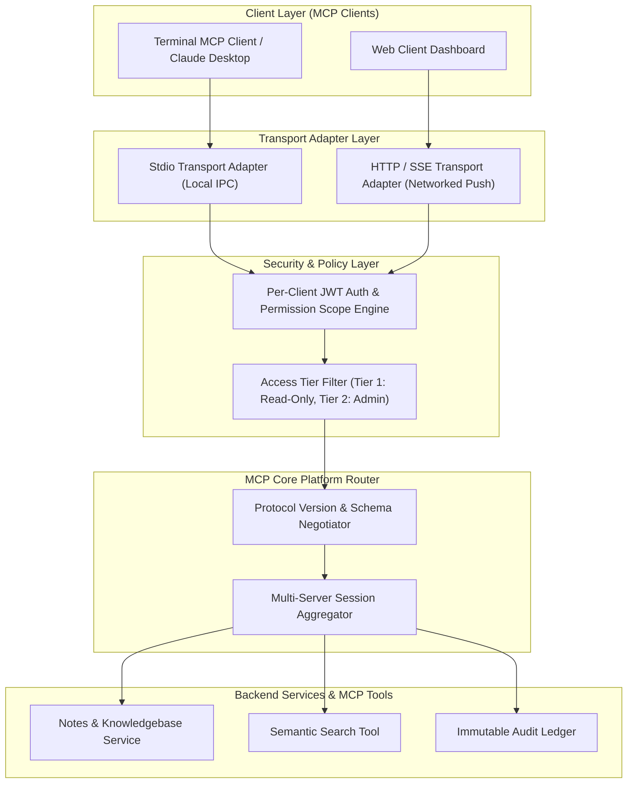
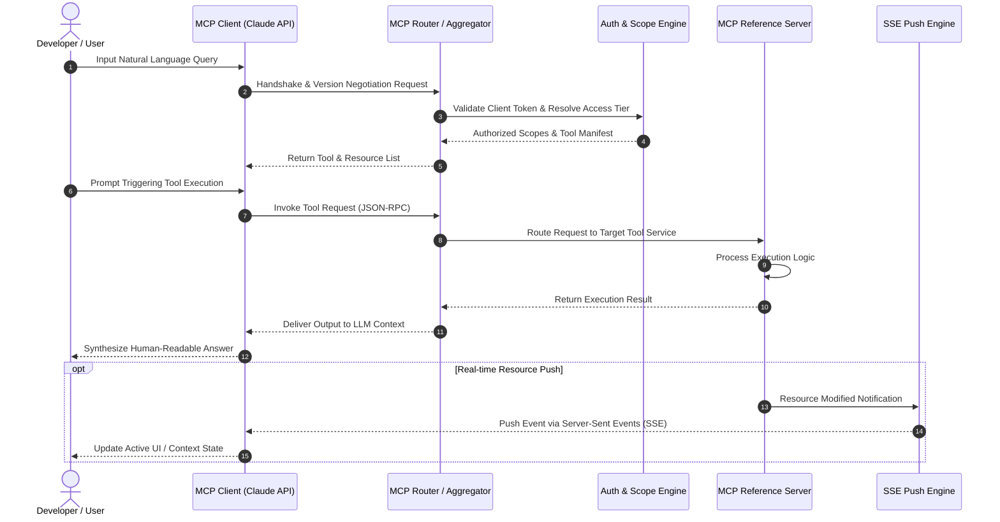

# 🚀 Agent Interoperability & Protocol Engineering Platform (MCP / A2A)

[](https://modelcontextprotocol.io)
[](https://typescriptlang.org)
[](https://python.org)
[](https://nodejs.org)
[](LICENSE)

A production-grade, enterprise reference implementation of Anthropic's **Model Context Protocol (MCP)** for standardized **Agent-to-Agent (A2A)** inter-agent communication, tool discovery, resource management, and multi-server aggregation.

---

## 👥 Project Authors & Metadata

- **Authors**: Surbhi Agarwal & Triveni Reddy
- **Track**: AI/LLM Engineering & Protocol Design
- **Domain**: Developer Infrastructure / Distributed Agent Systems
- **Timeline**: 6–8 Weeks
- **Stack**: Langchain, Python · Official Anthropic MCP SDK
- **Version**: `1.0.0` (September 2026)

---

## 📌 Executive Summary

Modern AI applications often suffer from fragmented, proprietary glue code to connect Large Language Models (LLMs) to tools and external data stores. The **Agent Interoperability Platform** provides an end-to-end reference implementation of the **Model Context Protocol (MCP)**. 

This platform enables any standard MCP client (e.g. Claude Desktop or custom terminal clients) to dynamically discover server-exposed tools and resources at runtime, execute RPC calls over swappable transport layers (`stdio` and `HTTP/SSE`), enforce per-client access control scopes, and receive real-time server-initiated push updates.

---

## 🏗️ Architecture Topology

### 1. System Topology Diagram



---

### 2. Protocol Interaction & Sequence Diagram



---

## 🧰 Repository Component Matrix

| Subsystem | Location | Stack | Description |
| :--- | :--- | :--- | :--- |
| **MCP Reference Server** | [`mcp-notes-project/server/`](./mcp-notes-project/server) | Node.js, Express, TypeScript | Exposes tools, resources, and real-time SSE push endpoints |
| **MCP Client** | [`mcp-notes-project/client/`](./mcp-notes-project/client) | TypeScript, Anthropic SDK | Discovers, negotiates, and executes tool calls using Claude API |
| **Product Specs (PRD)** | [`mcp-notes-project/PRD.md`](./mcp-notes-project/PRD.md) | Markdown | Product Requirements Document outlining functional tiers |
| **Technical Specs (TRD)** | [`mcp-notes-project/TRD.md`](./mcp-notes-project/TRD.md) | Markdown | Technical Requirements Document covering protocol specs |
| **Architecture (Overview)** | [`mcp-notes-project/Project_Overview.md`](./mcp-notes-project/Project_Overview.md) | Markdown | Comprehensive overview of system components and scope |

---

## ✨ Key Technical Capabilities

- 🔌 **Swappable Transports**: Supports both local `stdio` (inter-process communication for CLI tools) and `HTTP/SSE` (streaming push over HTTP).
- 🛡️ **Tiered Auth & Scope Engine**: Fine-grained JWT authentication restricting tool visibility based on client roles (e.g. `Read-Only` vs. `Admin`).
- 🔗 **Multi-Server Aggregation**: Single client session capable of merging tool manifests from multiple downstream MCP servers.
- ⚡ **Live Resource Subscriptions**: Real-time push updates delivering state changes to connected clients via Server-Sent Events.
- 🤝 **Version Negotiation**: Dynamic schema fallback ensuring backwards compatibility across protocol releases.

---

## ⚡ Quick Start & Installation

### Prerequisites
- **Node.js**: `v20.0.0` or higher
- **npm**: `v9.0.0` or higher
- **Anthropic API Key**: `ANTHROPIC_API_KEY` set in your environment

### 1. Installation
```bash
git clone https://github.com/SurbhiAgarwal1/Agent-to-Agent-MCP-.git
cd Agent-to-Agent-MCP-/mcp-notes-project
npm install
```

### 2. Start the MCP Server
```bash
cd server
npm run build
npm start
```

### 3. Start the MCP Client
```bash
# In a new terminal
cd client
npm run build
npm start
```

---

## 🗓️ 6–8 Week Project Roadmap

- **Week 1**: Monorepo Architecture & MCP SDK Initialization
- **Week 2**: Server Implementation (Tools, Resources & Handshake)
- **Week 3**: Client Discovery Engine & Claude Integration
- **Week 4**: Swappable Transport Layer (`stdio` + `HTTP/SSE`)
- **Week 5**: Per-Client Auth Scoping & Role Filters
- **Week 6**: Multi-Server Aggregator Proxy Engine
- **Week 7**: SSE Live Subscriptions & Real-Time Push Events
- **Week 8**: Protocol Conformance Testing, Documentation & Final Demo

---

## 📄 License

Distributed under the **MIT License**. See `LICENSE` for details.

---

<p align="center">
  <i>Maintained by <b>Surbhi Agarwal</b> & <b>Triveni Reddy</b> · September 2026</i>
</p>
