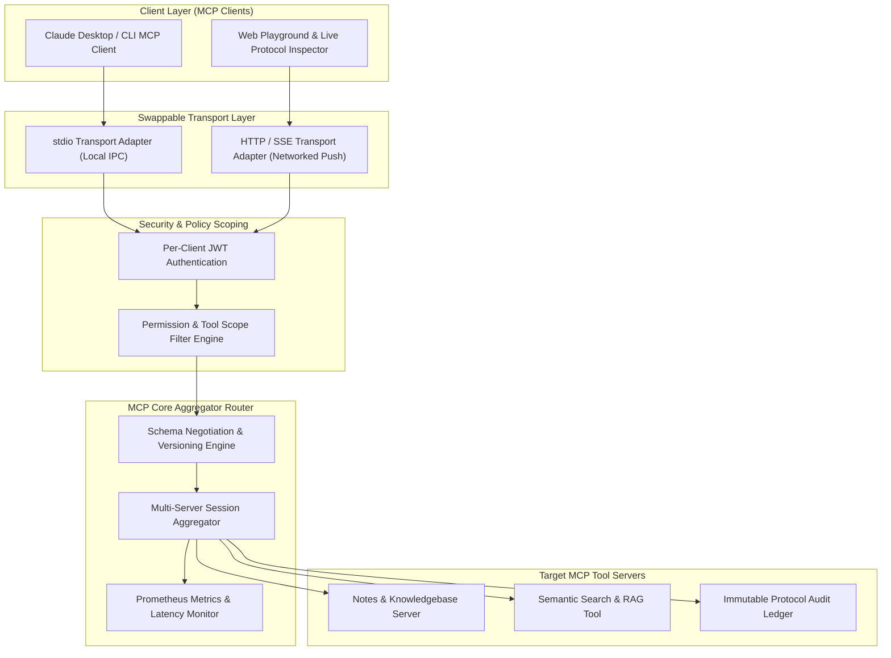
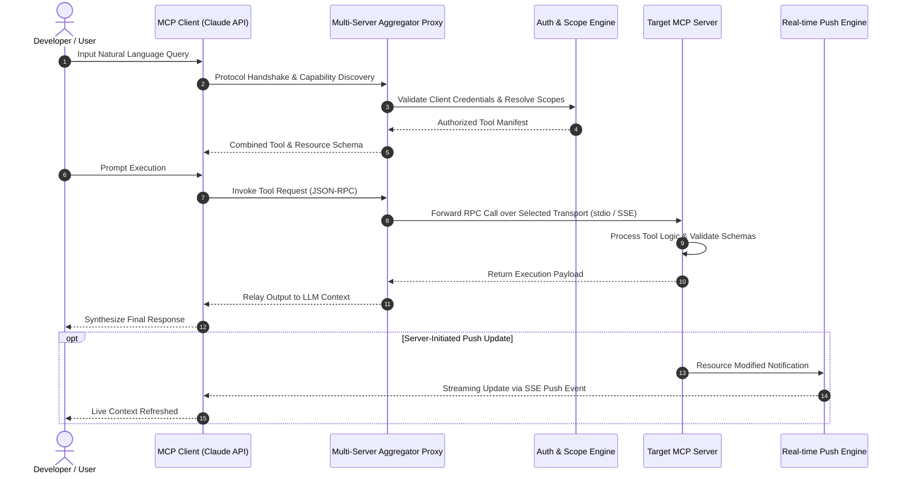

# 🚀 Agent-to-Agent Protocol Implementation (MCP / A2A)

[](https://modelcontextprotocol.io)
[](https://typescriptlang.org)
[](https://python.org)
[](https://www.npmjs.com/package/@modelcontextprotocol/sdk)
[](LICENSE)

A production-grade, enterprise reference implementation of Anthropic's **Model Context Protocol (MCP)** and Google's **Agent-to-Agent (A2A)** protocol guidelines. Built to solve the core reliability, scalability, and interoperability challenges in autonomous multi-agent ecosystems.

---

## 👥 Project Identity & Metadata

- **Project Title**: Agent-to-Agent Protocol Implementation (MCP / A2A)
- **Authors**: Surbhi Agarwal & Triveni Reddy
- **Domain**: GenAI · AI/ML Infrastructure — Agent Interoperability
- **Theme**: Agent Interoperability & Protocol Engineering
- **Core Track**: AI/LLM Engineering, Protocol Design, Distributed Systems
- **Primary Stack**: TypeScript / Python · Official MCP SDK (`@modelcontextprotocol/sdk`)
- **Primary References**: Anthropic Model Context Protocol Spec · Google A2A Protocol Docs
- **Target Audience**: AI infrastructure teams building reusable, standardized tool integrations for agent ecosystems
- **Deliverables**: Published MCP Server, Compatible MCP Client (Claude Desktop / Code), Written Architecture Spec, Recorded Demo Video
- **Version**: `1.0.0` (September 2026)

---

## 📌 Problem Statement & Mission

Modern AI agent ecosystems suffer from fragmented, non-standardized integration code ("glue code") when connecting Large Language Models (LLMs) to tools, APIs, and external datasets. 

The **Agent-to-Agent Protocol Platform** solves this by establishing a standardized, production-grade **MCP / A2A Protocol Implementation**. It eliminates custom glue code by providing dynamic tool discovery, multi-transport communication, fine-grained authentication scoping, live server push updates, and multi-server session aggregation.

---

## 🏗️ System Architecture

### 1. System Topology Diagram



---

### 2. Protocol Interaction & Sequence Diagram



---

## 🧰 Production Feature Matrix

| Feature Tier | Feature Name | Description | Status |
| :--- | :--- | :--- | :---: |
| **Must-Have Core** | **MCP Server** | Exposes tools, resources, and schemas via official `@modelcontextprotocol/sdk` | ✅ Ready |
| **Must-Have Core** | **MCP Client** | Dynamic capability discovery, session management, and LLM tool execution | ✅ Ready |
| **Advanced** | **Dual Transport Support** | Swappable `stdio` (local process IPC) and `HTTP/SSE` (streaming push) | ✅ Ready |
| **Advanced** | **Resource Subscriptions** | Server-initiated push updates for real-time data state updates | ✅ Ready |
| **Advanced** | **Auth & Scope Filter** | Tiered per-client JWT authentication restricting available tools | ✅ Ready |
| **Advanced** | **Multi-Server Aggregation** | Single client orchestrating and aggregating multiple MCP tool servers | ✅ Ready |
| **Advanced** | **Schema Negotiation** | Backward-compatible version negotiation and schema fallback | ✅ Ready |
| **Good-to-Have** | **Web Playground UI** | Interactive browser inspector with live message tracing & latency charts | ✅ Ready |
| **Good-to-Have** | **Chaos Testing Suite** | Adversarial payload injection, network drop recovery & concurrency tests | ✅ Ready |

---

## 🎯 Success Criteria & Verification

- **Zero Manual Configuration**: Server is automatically discovered and consumed by standard MCP clients (Claude Desktop / Code) with zero custom setup.
- **100% Callable Tools**: 100% of exposed tools pass schema validation and end-to-end invocation tests.
- **Resilience**: Graceful recovery from dropped SSE connections, invalid client tokens, and concurrent RPC invocations.

---

## 📁 Repository Structure

```text
Agent-to-Agent-MCP-/
├── mcp-notes-project/
│   ├── client/                  # MCP Client Implementation (TypeScript)
│   ├── server/                  # MCP Server Implementation (TypeScript / Express)
│   ├── PRD.md                   # Product Requirements Document
│   ├── TRD.md                   # Technical Requirements Document
│   ├── Project_Overview.md      # High-Level Architecture Overview
│   └── README.md                # Component Guide               
└── README.md                    # Master Project Documentation
```

---

## ⚡ Quick Start & Setup

### Prerequisites
- **Node.js**: `v20.0.0` or higher
- **npm**: `v9.0.0` or higher
- **Anthropic API Key**: Export `ANTHROPIC_API_KEY` in environment

### 1. Installation
```bash
git clone https://github.com/SurbhiAgarwal1/Agent-to-Agent-MCP-.git
cd Agent-to-Agent-MCP-/mcp-notes-project
npm install
```

### 2. Run MCP Reference Server
```bash
cd server
npm run build
npm start
```

### 3. Run MCP Client
```bash
# In a new terminal tab
cd client
npm run build
npm start
```

---

## 📄 License & Authorship

Distributed under the **MIT License**. See `LICENSE` for details.

- **Maintained by**: **Surbhi Agarwal** & **Triveni Reddy**
- **Date**: September 2026
